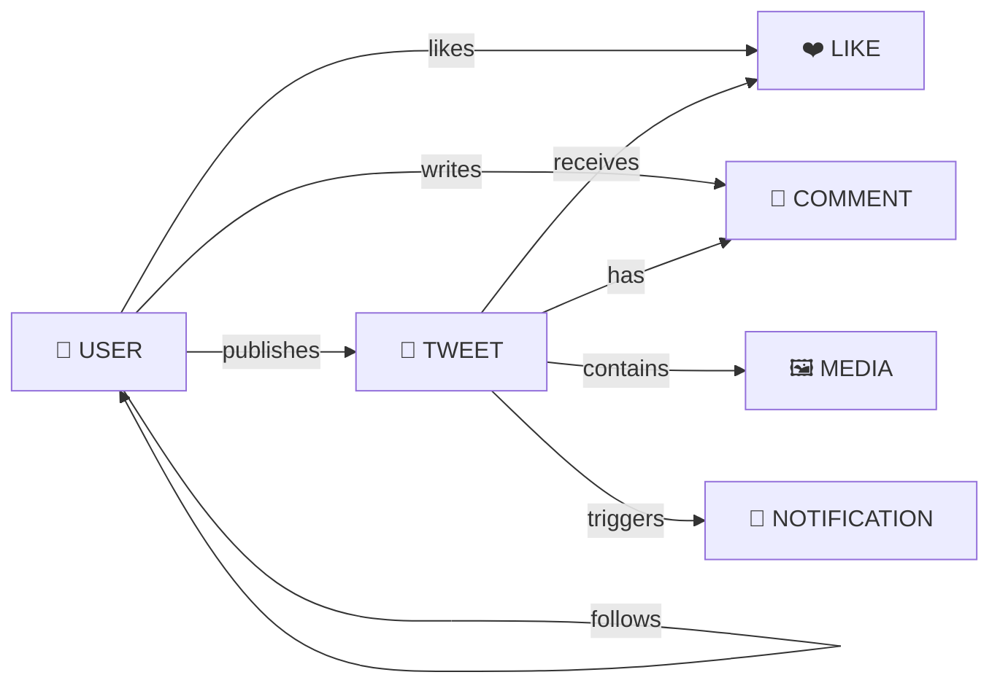

# 📐 Master System Design Blueprint

Welcome to the Master Blueprint for the Twitter Backend! This document gives you the **big picture** of how our entire backend is architected in a clean, simple, and high-level way.

---

## 1. The Big Picture: How Everything Connects

When 1 Million users open Twitter every day, they expect instant timelines, quick likes, and reliable notifications. Here is how our backend storage and compute tools work together to make that happen:

```
[ 📱 Client Apps ] (iOS, Android, Web)
         │
         ├─── 1. Static Images / Avatars ───► [ CloudFront CDN ] ───► [ AWS S3 Object Storage ]
         │
         └─── 2. API Requests ─────────────► [ Load Balancer ]
                                                    │
                                                    ▼ (Round-Robin Traffic)
                                           [ Express API Servers ]
                                           (Stateless App Nodes)
                                                    │
             ┌──────────────────────────────────────┼──────────────────────────────────────┐
             │                                      │                                      │
  (Permanent │ Data Storage)            (Instant Hot│Feeds & Sessions)    (Background Event│Bus)
             ▼                                      ▼                                      ▼
┌──────────────────────────┐             ┌─────────────────────┐             ┌───────────────────┐
│  PostgreSQL Relational   │             │ Redis Cache Cluster │             │   Apache Kafka    │
│  Master & Read Replicas  │             │ (In-Memory Storage) │             │  Event Brokers    │
└──────────────────────────┘             └──────────▲──────────┘             └─────────┬─────────┘
                                                    │                                  │
                                                    │ (Push Feed IDs)                  ▼
                                         ┌─────────────────────┐             ┌───────────────────┐
                                         │ Timeline Feed Worker│◄────────────┤ Notification Push │
                                         └─────────────────────┘             │ Background Workers│
                                                                             └───────────────────┘
```

### 🧰 Why We Chose Each Tool
* **Node.js & Express**: Fast, lightweight, and perfect for handling thousands of concurrent user connections.
* **PostgreSQL (The Permanent Vault)**: Stores relational data like user profiles, tweets, follows, and comments safely with strict ACID guarantees (so data is never lost or corrupted).
* **Redis (The Lightning Cache)**: Holds user sessions and pre-computed home timelines in RAM so feeds load in under 5 milliseconds!
* **Apache Kafka (The Asynchronous Messenger)**: When a celebrity tweets, Kafka takes over behind the scenes to update millions of follower timelines and send notifications without freezing the web server.

---

## 2. The Request Pipeline: One Job Per Layer

Imagine passing a bucket down a fire brigade line. In our backend, every incoming HTTP request travels through a strict, 4-step assembly line. **Every layer has exactly ONE job**:

```
[ Incoming Request: POST /tweets ]
               │
               ▼
┌────────────────────────────────────────────────────────┐
│ 1. Express Router                                      │
│    👉 The Traffic Cop: "Which controller handles this?"│
└──────────────────────────┬─────────────────────────────┘
                           │
                           ▼
┌────────────────────────────────────────────────────────┐
│ 2. Controller Layer                                    │
│    👉 The Receptionist: Reads user input, calls the    │
│       service, and sends back the HTTP JSON response.  │
└──────────────────────────┬─────────────────────────────┘
                           │
                           ▼
┌────────────────────────────────────────────────────────┐
│ 3. Service Layer (Business Logic)                      │
│    👉 The Brain: Checks rules ("Is content not empty?  │
│       Is user banned?") and makes decisions.           │
└──────────────────────────┬─────────────────────────────┘
                           │
                           ▼
┌────────────────────────────────────────────────────────┐
│ 4. Repository Layer                                    │
│    👉 The Librarian: Talks directly to PostgreSQL      │
│       (INSERT, SELECT, UPDATE, DELETE).                │
└────────────────────────────────────────────────────────┘
```

> 💡 **Why do we do this?** If we mixed everything together in one file, changing our database from PostgreSQL to MongoDB later would require rewriting our entire business logic! By keeping layers separate, testing and maintaining code becomes effortless.

---

## 3. Core Domain Entities (What We Store)

Our social network revolves around **7 core concepts**. Here is a high-level look at how they connect:



* **User**: An account with an email, username, hashed password, bio, and profile avatar.
* **Tweet**: A short message ($\le 280$ characters) published by a user.
* **Follow**: A one-way link between a *Follower* and the account they are *Following*.
* **Like**: An affirmative interaction linking a User to a Tweet.
* **Comment**: A threaded reply attached to a parent Tweet.
* **Notification**: An alert informing a user that someone followed them, liked their tweet, or replied.
* **Media**: An image or graphic stored in AWS S3 and linked to a tweet.

---

## 4. API Endpoints Summary

Here is a high-level cheat sheet of our core RESTful API endpoints:

| Feature Area | Method | Endpoint URL | Who Can Access? | What Does It Do? |
| :--- | :---: | :--- | :---: | :--- |
| **Auth** | `POST` | `/api/v1/auth/signup` | Public | Create a new account and get login tokens. |
| **Auth** | `POST` | `/api/v1/auth/login` | Public | Log in with email/password and get JWT tokens. |
| **Users** | `GET` | `/api/v1/users/:username` | Public | View anyone's public profile and follower count. |
| **Tweets** | `POST` | `/api/v1/tweets` | Logged In | Publish a new tweet with optional image links. |
| **Tweets** | `DELETE` | `/api/v1/tweets/:id` | Tweet Owner | Delete your own tweet. |
| **Feeds** | `GET` | `/api/v1/feed/home` | Logged In | Get your personalized home timeline (fast scroll). |
| **Social** | `POST` | `/api/v1/users/:id/follow` | Logged In | Follow a target user account. |
| **Social** | `DELETE`| `/api/v1/users/:id/follow` | Logged In | Unfollow a target user account. |

---

## 5. Security & Authentication Overview

How does the server know who you are without making you log in on every single button click?

1. **No Plaintext Passwords**: We never store actual passwords in the database. We use **Argon2 / bcrypt** to turn your password into an unreadable cryptographic hash (`$2b$12$e9k...`). Even if a hacker steals the database, they cannot read your password!
2. **Stateless JWT Tokens**: When you log in, the server gives you a digital badge called a **JSON Web Token (JWT)**.
3. **Every Request**: When you click "Like Tweet", your app sends this JWT badge in the request header. Our security middleware checks the badge signature and says: *"Ah, this is User #101! Let them pass."*
4. **Token Rotation**: To keep you super safe, your Access Badge expires every **15 minutes**. A secure, hidden **Refresh Cookie** automatically gets you a new badge in the background without bothering you!

---

## 6. Explore the Detailed Chapters

Want to dive deeper into any specific topic? Check out our 9 easy-to-read guides in the `docs/` folder:

1. [**01. Problem Statement & Scope**](./docs/01-problem-statement-and-scope.md)
2. [**02. Requirement Analysis & Scale Estimation**](./docs/02-requirement-analysis-and-scale.md)
3. [**03. High-Level Architecture (HLA)**](./docs/03-high-level-architecture.md)
4. [**04. Domain Modeling**](./docs/04-domain-modeling.md)
5. [**05. Database Design**](./docs/05-database-design.md)
6. [**06. API Design & REST Specs**](./docs/06-api-design.md)
7. [**07. Software Layers (LLD)**](./docs/07-low-level-design.md)
8. [**08. Authentication & Security System**](./docs/08-authentication-system.md)
9. [**09. Development & Scaling Strategy**](./docs/09-development-and-scaling-strategy.md)
