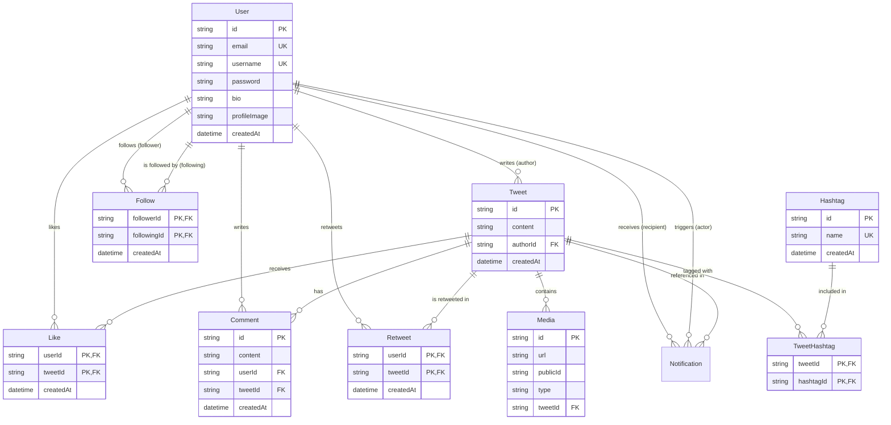

# 🗄️ Database Schema Relations, Connections, Code & Diagrams

This document provides a comprehensive breakdown of the database design, table relationships, entity connections, visual Entity-Relationship (ER) diagrams, and the actual Prisma ORM schema implementation.

---

## 1. Table Architecture Overview

The system consists of **9 relational tables** designed in PostgreSQL, utilizing normal forms to eliminate data redundancy while maintaining high query performance through strategic B-tree indexing and composite keys.

| Table Name | Primary Purpose | Key Architectural Highlight |
| :--- | :--- | :--- |
| **`User`** | Stores account credentials and profile info | Core root entity; referenced by almost every table in the system. |
| **`Tweet`** | Stores user posts and text content | Root content entity; cascades deletions to likes, comments, and media. |
| **`Follow`** | Manages follower/following social graph | Self-referential Many-to-Many junction table on `User`. |
| **`Like`** | Tracks tweet likes | Junction table with composite primary key `@@id([userId, tweetId])`. |
| **`Comment`** | Stores replies to tweets | One-to-Many relation linked to both `User` and `Tweet`. |
| **`Retweet`** | Tracks tweet reposts without content duplication | Junction table with composite primary key `@@id([userId, tweetId])`. |
| **`Notification`** | Stores user activity alerts | Double relation to `User` (`recipientId` and `actorId`). |
| **`Media`** | Tracks Cloudinary images and videos | Cascading child of `Tweet`. |
| **`Hashtag`** | Stores unique normalized hashtags | Normalized lookup table with `@unique` constraint on `name`. |
| **`TweetHashtag`** | Links tweets to hashtags | Many-to-Many junction table with `@@id([tweetId, hashtagId])`. |

---

## 2. Entity-Relationship (ER) Visual Diagram



---

## 3. Detailed Relational Connections Explained

### 1. One-to-Many (1:M) Relationships
In 1:M relationships, a parent record can own multiple child records, but each child record belongs to exactly one parent.
- **`User` ➔ `Tweet` (`authorId`):** One user can publish thousands of tweets. When a user is deleted, all their tweets are removed.
- **`User` ➔ `Comment` (`userId`) & `Tweet` ➔ `Comment` (`tweetId`):** A comment is an intersection of a user replying to a tweet. Both foreign keys use `onDelete: Cascade`.
- **`Tweet` ➔ `Media` (`tweetId`):** One tweet can attach multiple images or videos.
- **`User` ➔ `Notification` (`recipientId` & `actorId`):** Notifications link two users: the person receiving the alert (`recipient`) and the person who performed the action (`actor`).

### 2. Many-to-Many (M:N) Relationships via Junction Tables
Relational databases cannot store M:N relationships directly without creating infinite arrays or redundant data. We solve this by introducing **Junction Tables** (also called Associative Entities) with **Composite Primary Keys**.

#### A. The Social Graph (`Follow` Table)
```
[ User: Alice ] ──(followerId)──┐
                                ▼
                       [ Follow Junction Table ] ── Primary Key: (followerId, followingId)
                                ▲
[ User: Bob ]   ──(followingId)─┘
```
- A user can follow many people, and be followed by many people.
- The `Follow` table acts as a bridge. Its composite primary key `@@id([followerId, followingId])` ensures Alice cannot follow Bob twice.

#### B. Tweet Engagements (`Like` & `Retweet` Tables)
- One user can like/retweet many tweets; one tweet can be liked/retweeted by many users.
- Both tables use `@@id([userId, tweetId])`. This eliminates duplicate likes or retweets at the storage level without locking tables in application code.

#### C. Content Tagging (`Hashtag` & `TweetHashtag` Tables)
```
[ Tweet 1: "#nodejs #redis" ] ──(tweetId)──┐
                                           ▼
                                [ TweetHashtag Junction ] ── Key: (tweetId, hashtagId)
                                           ▲
[ Hashtag: "nodejs" ]         ──(hashtagId)┘
```
- If we stored hashtags directly inside the `Tweet` table as text strings, renaming a hashtag or counting trending volume would require scanning every tweet in the database.
- Instead, `Hashtag` stores unique tag names once (`@unique`). `TweetHashtag` connects tweets to hashtags cleanly. Counting trending tags is as fast as running `GROUP BY hashtagId` on the junction table!

---

## 4. Complete Prisma Schema Code Implementation

Below is the production `prisma/schema.prisma` code showing exactly how these tables, foreign keys, indexes, and cascading delete rules are implemented:

```prisma
generator client {
  provider = "prisma-client-js"
}

datasource db {
  provider = "postgresql"
  url      = env("DATABASE_URL")
}

model User {
  id           String   @id @default(cuid())
  email        String   @unique
  username     String   @unique
  password     String
  bio          String?
  profileImage String?
  createdAt    DateTime @default(now())
  updatedAt    DateTime @updatedAt

  tweets       Tweet[]
  followers    Follow[] @relation("UserFollowers")
  following    Follow[] @relation("UserFollowing")
  likes        Like[]
  comments     Comment[]
  retweets     Retweet[]

  receivedNotifications Notification[] @relation("NotificationRecipient")
  triggeredNotifications Notification[] @relation("NotificationActor")
}

model Tweet {
  id        String   @id @default(cuid())
  content   String
  authorId  String
  author    User     @relation(fields: [authorId], references: [id], onDelete: Cascade)

  likes     Like[]
  comments  Comment[]
  retweets  Retweet[]
  media     Media[]
  hashtags  TweetHashtag[]
  notifications Notification[]

  createdAt DateTime @default(now())
  updatedAt DateTime @updatedAt
}

model Follow {
  followerId  String
  followingId String

  follower    User @relation("UserFollowing", fields: [followerId], references: [id], onDelete: Cascade)
  following   User @relation("UserFollowers", fields: [followingId], references: [id], onDelete: Cascade)

  createdAt   DateTime @default(now())

  @@id([followerId, followingId])
}

model Like {
  userId    String
  tweetId   String

  user      User  @relation(fields: [userId], references: [id], onDelete: Cascade)
  tweet     Tweet @relation(fields: [tweetId], references: [id], onDelete: Cascade)

  createdAt DateTime @default(now())

  @@id([userId, tweetId])
}

model Comment {
  id        String   @id @default(cuid())
  content   String

  userId    String
  tweetId   String

  user      User  @relation(fields: [userId], references: [id], onDelete: Cascade)
  tweet     Tweet @relation(fields: [tweetId], references: [id], onDelete: Cascade)

  createdAt DateTime @default(now())
  updatedAt DateTime @updatedAt
}

model Retweet {
  userId    String
  tweetId   String

  user      User  @relation(fields: [userId], references: [id], onDelete: Cascade)
  tweet     Tweet @relation(fields: [tweetId], references: [id], onDelete: Cascade)

  createdAt DateTime @default(now())

  @@id([userId, tweetId])
}

model Notification {
  id          String           @id @default(cuid())
  type        NotificationType
  recipientId String
  actorId     String
  tweetId     String?
  isRead      Boolean          @default(false)
  createdAt   DateTime         @default(now())

  recipient   User   @relation("NotificationRecipient", fields: [recipientId], references: [id], onDelete: Cascade)
  actor       User   @relation("NotificationActor", fields: [actorId], references: [id], onDelete: Cascade)
  tweet       Tweet? @relation(fields: [tweetId], references: [id], onDelete: Cascade)
}

enum NotificationType {
  LIKE
  COMMENT
  FOLLOW
  RETWEET
}

model Media {
  id       String    @id @default(cuid())
  url      String
  publicId String
  type     MediaType

  tweetId  String
  tweet    Tweet  @relation(fields: [tweetId], references: [id], onDelete: Cascade)

  createdAt DateTime @default(now())
}

enum MediaType {
  IMAGE
  VIDEO
}

model Hashtag {
  id        String @id @default(cuid())
  name      String @unique

  tweets    TweetHashtag[]

  createdAt DateTime @default(now())
}

model TweetHashtag {
  tweetId   String
  hashtagId String

  tweet      Tweet @relation(fields: [tweetId], references: [id], onDelete: Cascade)
  hashtag    Hashtag @relation(fields: [hashtagId], references: [id], onDelete: Cascade)

  @@id([tweetId, hashtagId])
}
```
