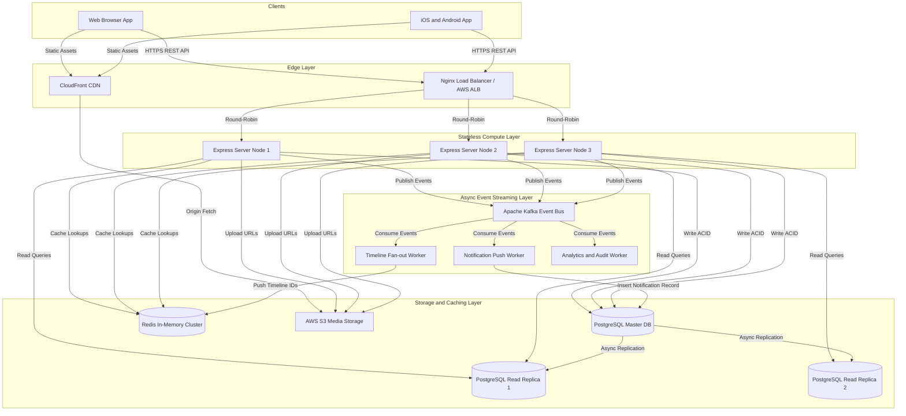

# Chapter 3. High-Level Architecture (HLA)

> **How do all the pieces work together?** A simple, visual guide to our server components, caching strategies, and background event processors.

---

## 1. The Architecture Map

When a user opens Twitter, their request travels across the internet through several specialized layers. Here is the exact layout of our servers and databases:

### 🏛️ ASCII Architecture Topology
```
[ 📱 Web / Mobile Clients ]
         │
         ├─── (Static Assets & Photos) ──► [ CloudFront CDN ] ───► [ AWS S3 Media ]
         │
         └─── (API Requests) ────────────► [ Load Balancer / Nginx ]
                                                    │
                                                    ▼ (Round-Robin Traffic)
                                           [ Express API Servers ]
                                           (Stateless App Nodes)
                                                    │
             ┌──────────────────────────────────────┼──────────────────────────────────────┐
             │                                      │                                      │
  (Permanent │ Data Storage)            (Instant Hot│Feeds & Sessions)    (Background Event│Bus)
             ▼                                      ▼                                      ▼
┌──────────────────────────┐             ┌─────────────────────┐             ┌───────────────────┐
│  PostgreSQL Relational   │             │ Redis Cache Cluster │             │   Apache Kafka    │
│  Master & Read Replicas  │             │ (In-Memory Storage) │             │  Event Brokers    │
└──────────────────────────┘             └──────────▲──────────┘             └─────────┬─────────┘
                                                    │                                  │
                                                    │ (Push Feed IDs)                  ▼
                                         ┌─────────────────────┐             ┌───────────────────┐
                                         │ Timeline Feed Worker│◄────────────┤ Notification Push │
                                         └─────────────────────┘             │ Background Workers│
                                                                             └───────────────────┘
```

### 📊 Interactive Flowchart (Mermaid)


---

## 2. Why Start as a Monolith instead of Microservices?

Many beginners try to build 10 different microservice repositories on Day 1. While microservices are great for companies with 5,000 engineers, they introduce massive network delays and complicated debugging for new projects!

We choose a **Modular Monolith** for Version 1 because:
1. **Lightning-Fast Speed**: When a user posts a tweet, our internal modules communicate instantly in computer memory ($\le 1\text{ms}$) rather than making slow network calls across servers.
2. **Safe Database Transactions**: If a user deletes their account, we can clean up their profile, tweets, and likes safely inside a single database transaction.
3. **Microservice-Ready by Design**: We organize our folders cleanly by **feature** (`/user`, `/tweet`, `/feed`). When our traffic grows past 10 Million users, we can easily slice out any folder into its own independent microservice without rewriting our code!

---

## 3. Stateless Web Servers (The Secret to Easy Scaling)

To make sure our app never goes down (99.99% Uptime), our Express API servers are **100% Stateless**.
* **What is stateless?** It means the web server does not store user login sessions or uploaded photos on its local hard drive.
* **Why does this matter?** If Server Node #1 suddenly crashes or gets restarted, Nginx automatically redirects traffic to Server Node #2. Because login data lives safely in Redis and photos live in AWS S3, the user experiences zero interruption!

---

## 4. How We Use Redis (Lightning-Fast Memory Caching)

Reading data from a hard drive is slow. Reading data from computer RAM (Redis) is 100 times faster! We use Redis for three things:

1. **User Profile Cache**: When someone visits a popular profile, we check Redis first. If it's there, we return it instantly in **2 milliseconds**!
2. **Pre-Computed Home Timelines**: When a celebrity tweets, checking the database for all 5 million followers would freeze the system. Instead, our background workers push the new Tweet ID directly into each follower's **Redis Timeline List**. When you open your app, we just read the top 20 IDs from RAM!
3. **Rate Limiting**: To prevent hackers from spamming login attempts, Redis counts how many times an IP address tries to log in, blocking them if they exceed 5 attempts in 15 minutes.

---

## 5. Why We Need Kafka (Asynchronous Background Workers)

Imagine you post a tweet, and you have to wait 10 seconds for the server to finish sending notification emails to all your followers before your screen loads. You would close the app!

We use **Apache Kafka** to separate **fast tasks** from **slow tasks**:

```
[ POST /api/v1/tweets ]
         │
         ▼
 ┌──────────────────────────────────────┐
 │ 1. Save Tweet to PostgreSQL          │ ──(5ms)──► [ Return HTTP 201 Success to User! ]
 └──────────────────┬───────────────────┘
                    │
                    ▼
 ┌──────────────────────────────────────┐
 │ 2. Send Message to Kafka Bus         │ ──(2ms)──► "Hey Kafka, Tweet #101 was created!"
 └──────────────────────────────────────┘
                    │
                    │ (Happens Behind the Scenes)
                    ▼
 ┌────────────────────────────────────────────────────────┐
 │ Kafka Background Workers                               │
 │  ├─► Timeline Worker: Adds Tweet #101 to follower feeds│
 │  └─► Notification Worker: Sends mobile push alerts     │
 └────────────────────────────────────────────────────────┘
```

> 💡 **The Result**: You get a success message in **15 milliseconds**, while Kafka calmly handles all the heavy background lifting at its own pace!
