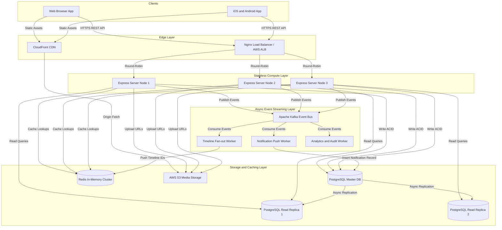

# Chapter 3. High-Level Architecture (HLA)

> **Objective**: Define the end-to-end system topology, detail how system components interact across the network, justify our choice of a Layered Modular Monolith over immediate microservices, and explain our caching and asynchronous event processing strategies.

---

## 3.1 Architecture Topology & Data Flow

Our architecture follows a clean, decoupled distributed system topology. Incoming client requests pass through edge routing and validation layers before reaching our stateless application servers, which coordinate persistence, caching, and async event streaming.

### 🏛️ ASCII Architecture Topology
```
[ Web / Mobile Clients ]
         │
         ├─── (Static Assets) ───► [ CloudFront CDN ] ───► [ AWS S3 Media ]
         │
         └─── (HTTPS REST API) ──► [ Load Balancer / Nginx ]
                                            │
                                            ▼ (Round-Robin)
                                   [ Stateless Compute ]
                                 (Express Nodes 1, 2, 3)
                                            │
           ┌────────────────────────────────┼────────────────────────────────┐
           │                                │                                │
 (ACID     │                     (Read      │                      (Session  │        (Publish
  Write)   ▼                      Replicas) ▼                       / Feed)  ▼         Events)
┌──────────────────────┐   ┌──────────────────────────┐   ┌─────────────────────┐       │
│ PostgreSQL Master DB │──►│ PostgreSQL Read Replicas │   │ Redis Cache Cluster │       │
└──────────┬───────────┘   └──────────────────────────┘   └──────────▲──────────┘       │
           │                                                         │                  ▼
           │  ┌──────────────────────────────────────────────────────┴──────┐  ┌────────────────┐
           │  │                      Kafka Event Bus                        │◄─┤ Apache Kafka   │
           │  └──────┬──────────────────────────────┬───────────────────────┘  │ Brokers        │
           │         │                              │                          └────────────────┘
           ▼         ▼                              ▼
 [ Notification Push Worker ]           [ Timeline Fan-out Worker ]
```

### 📊 Interactive Flowchart (Mermaid)


---

## 3.2 Why a Modular Monolith (Instead of Microservices)?

A common mistake in modern backend engineering is adopting microservices on Day 1. While microservices solve organizational scaling problems for massive teams, they introduce immense distributed system complexities: network latency, distributed transactions, saga patterns, service discovery, and DevOps overhead.

We adopt a **Modular Monolith** architecture for Version 1 because:
1.  **In-Memory Method Calls**: Communication between the `UserModule` and `TweetModule` happens via sub-millisecond in-memory function calls, rather than slow HTTP/gRPC network calls over localhost or VPCs.
2.  **ACID Transaction Simplicity**: When deleting a user account, we can wrap the deletion of their profile, tweets, and likes inside a single PostgreSQL atomic transaction (`BEGIN ... COMMIT`).
3.  **Refactoring Agility**: If our domain boundaries change during early development, moving code between folders is trivial compared to refactoring multi-repo microservices schemas.
4.  **Microservice-Ready by Design**: Because our codebase is strictly partitioned by **feature domain** (`src/modules/user/`, `src/modules/tweet/`) with no direct cross-module database table joins, any module can be extracted into an independent microservice later with zero refactoring of business logic.

---

## 3.3 Stateless Application Server Design

To achieve **High Availability (99.99%)** and horizontal scalability, our Express.js application servers must be **100% stateless**.

*   **No In-Memory Session State**: We never use standard in-memory `express-session` storage. User authentication identity is verified statelessly via signed JWT tokens or looked up in our distributed Redis cluster.
*   **No Local File Storage**: Uploaded images are never saved to the local server disk (`/tmp` or `/var/www`). The server generates an AWS S3 pre-signed URL, allowing the client to upload binary media directly to object storage.
*   **Any Server Can Handle Any Request**: If Nginx routes Request 1 from User A to Server Node 1, and Request 2 to Server Node 3, the user experiences zero disruption or session loss.

---

## 3.4 Caching Strategy (Redis Integration)

To meet our **$\le 100\text{ms}$ read SLA**, we utilize Redis for three distinct operational patterns:

### 1. Cache-Aside Pattern (User Profiles & Tweet Metadata)
When a client requests a user's profile (`GET /api/v1/users/sireesh`):
1.  The controller checks Redis for key `user:profile:sireesh`.
2.  **Cache Hit**: Return JSON immediately ($\approx 2\text{ms}$ latency).
3.  **Cache Miss**: Query PostgreSQL read replica ($\approx 15\text{ms}$), store the result in Redis with a **3600-second TTL (Time-To-Live)**, and return the response.

### 2. Fan-out on Write Pattern (Home Feed Timeline)
When a user publishes a tweet, generating their followers' home feeds on the fly via SQL joins would cause massive database bottlenecks. Instead, we use Redis Lists/Sorted Sets as pre-computed timelines:
1.  User publishes Tweet `#101`.
2.  The `TweetService` saves the tweet to PostgreSQL and publishes a `TWEET_CREATED` event to Kafka.
3.  The asynchronous **Timeline Fan-out Worker** consumes the event, fetches the author's followers, and pushes `Tweet ID #101` onto the top of each follower's Redis timeline list (`feed:home:user_id`).
4.  When a user loads their app, we simply read a slice of 20 IDs from Redis (`LRANGE feed:home:user_id 0 20`) and fetch the corresponding tweet objects in a single batch query.

### 3. Distributed Rate Limiting
To prevent DDoS attacks and API abuse, we implement a **Sliding Window Log** rate limiter using Redis sorted sets (`ZSET`), capping authentication endpoints at $5\text{ attempts per 15 minutes}$ per IP address.

---

## 3.5 Asynchronous Event Processing (Apache Kafka)

Synchronous execution of non-critical tasks during an HTTP request severely degrades write latency. We decouple heavy tasks using **Apache Kafka** event streaming:

```
[ POST /api/v1/tweets ]
         │
         ▼
 ┌──────────────────────────────────────┐
 │ 1. Save Tweet to PostgreSQL          │ ──(5ms)──► [ Commit DB Transaction ]
 └──────────────────┬───────────────────┘
                    │
                    ▼
 ┌──────────────────────────────────────┐
 │ 2. Emit Kafka Event: TWEET_CREATED   │ ──(2ms)──► [ Return HTTP 201 Created ]
 └──────────────────────────────────────┘
                    │
                    │ (Asynchronous Background Consumption)
                    ▼
 ┌────────────────────────────────────────────────────────┐
 │ Kafka Broker Topic: `social-events.tweet-created`      │
 └──────┬───────────────────────────┬─────────────────────┘
        │                           │
        ▼                           ▼
┌──────────────────────┐  ┌───────────────────────────────┐
│ Timeline Worker      │  │ Notification Worker           │
│ Fan-out Tweet ID to  │  │ Check if tweet contains `@`   │
│ Followers' Redis DB  │  │ mentions; insert notification │
└──────────────────────┘  └───────────────────────────────┘
```

> 💡 **Architectural Benefit**: By offloading fan-out and notifications to Kafka, our API response time for `POST /tweets` remains at an ultra-fast **$\approx 15\text{ms}$**, even if the author has 1 million followers!

---

## 3.6 Summary of Architectural Principles

1.  **Single Responsibility Principle (SRP)**: Each service, class, and architectural layer has one reason to change.
2.  **Loose Coupling & High Cohesion**: Feature modules operate independently; communication occurs via well-defined interface contracts and event buses.
3.  **Separation of Concerns**: Compute (Express), Relational Storage (PostgreSQL), High-Speed Caching (Redis), and Async Queues (Kafka) are cleanly separated and scaled independently.
