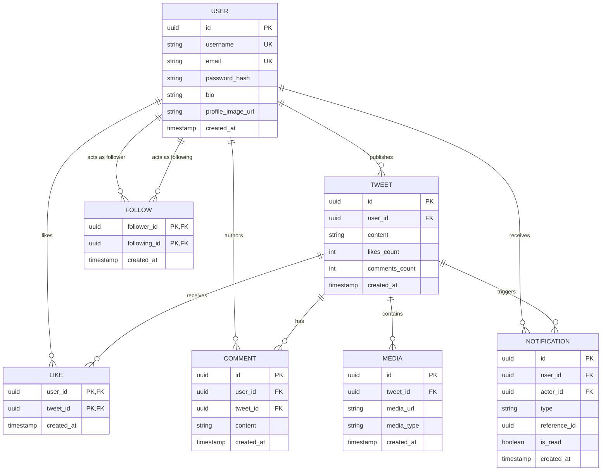

# Chapter 4. Domain Modeling

> **Objective**: Define the core domain entities of our Twitter backend, establish clear conceptual boundaries between feature aggregates, and map out the exact cardinality and relationships connecting these entities.

---

## 4.1 Core Domain Entities

A domain model represents the real-world concepts our software manages. In our social networking ecosystem, the architecture revolves around **7 primary domain entities**:

### 1. User
The central actor in the system. Represents a registered account with authentication credentials, public profile attributes (display name, bio, avatar), and account status flags.

### 2. Tweet
The fundamental unit of content. Represents a timestamped post published by a user. Can contain text ($\le 280$ characters), reference multimedia attachments, and maintain denormalized engagement counters (likes, comments).

### 3. Follow
A directed social graph relationship representing a unidirectional subscription between two user entities: a **Follower** (the user subscribing) and a **Following** (the target user being subscribed to).

### 4. Like
An engagement primitive representing an affirmative user interaction with a specific tweet. Acts as a unique join association preventing duplicate likes from the same user.

### 5. Comment
A threaded response attached to a specific parent tweet. Owned by the comment author and linked directly to the target tweet.

### 6. Notification
An alert generated by asynchronous system events (such as being followed, liked, or replied to) directed to a specific recipient user. Maintains a read/unread state.

### 7. Media
An external binary file attachment (such as an image or GIF) stored in object storage (AWS S3) and referenced via a metadata URL linked to a parent tweet.

---

## 4.2 Entity Relationship (ER) Diagram

The following Mermaid ER diagram illustrates the cardinality and structural dependencies between our domain entities:

---

## 4.3 Relationship Cardinality Analysis

Understanding relationship cardinality ensures our database foreign keys and cascading delete rules are structured correctly:

| Relationship Pair | Cardinality | Join Mechanism | Rules & Behavioral Description |
| :--- | :--- | :--- | :--- |
| **User $\leftrightarrow$ Tweet** | **One-to-Many** | `tweets.user_id` | One user can publish zero or millions of tweets. A tweet belongs to exactly one author. If a user is deleted, all their published tweets must be deleted (`CASCADE`). |
| **User $\leftrightarrow$ User (Follow)**| **Many-to-Many**| `follows` Table | A user can follow many accounts, and be followed by many accounts. Implemented via a junction table with a composite primary key `(follower_id, following_id)`. |
| **User $\leftrightarrow$ Tweet (Like)** | **Many-to-Many**| `likes` Table | A user can like many tweets, and a tweet can be liked by many users. Implemented via a junction table enforcing uniqueness on `(user_id, tweet_id)`. |
| **Tweet $\leftrightarrow$ Comment** | **One-to-Many** | `comments.tweet_id`| A tweet can have zero or many comments. If a parent tweet is deleted, all attached comments must be cascade deleted. |
| **Tweet $\leftrightarrow$ Media** | **One-to-Many** | `media.tweet_id` | A tweet can contain between 0 and 4 attached media images. Media records cannot exist without a parent tweet. |
| **User $\leftrightarrow$ Notification**| **One-to-Many**| `notifications.user_id`| A user receives many notifications over time. Notifications reference an action performer (`actor_id`) and a target entity (`reference_id`). |

---

## 4.4 Domain Aggregates & Boundaries

In Domain-Driven Design (DDD), an **Aggregate** is a cluster of domain objects that can be treated as a single unit for data changes. Every aggregate has a **Root Entity** that guarantees the consistency of changes within the boundary.

### 1. The User Aggregate
*   **Root**: `User`
*   **Boundary Rules**: Account authentication credentials, profile metadata, and account status are strictly encapsulated. Other modules cannot directly alter user table rows; they must interact via `UserService` interface contracts.

### 2. The Tweet Aggregate
*   **Root**: `Tweet`
*   **Child Entities**: `Media`
*   **Boundary Rules**: When a tweet is created, its attached media entities are created within the same atomic transaction. Media items cannot be added or modified independently of their parent tweet.

### 3. The Social Graph Aggregate
*   **Root**: `Follow`
*   **Boundary Rules**: Manages unidirectional relationships. Enforces invariant domain rules: *A user cannot follow themselves (`follower_id != following_id`)*, and duplicate follow relationships are impossible.

### 4. The Engagement Aggregate
*   **Root**: `Like`, `Comment`
*   **Boundary Rules**: Acts upon existing tweets. When a like or comment is created, it emits a domain event that atomically increments the denormalized `likes_count` or `comments_count` on the parent `Tweet` entity.
