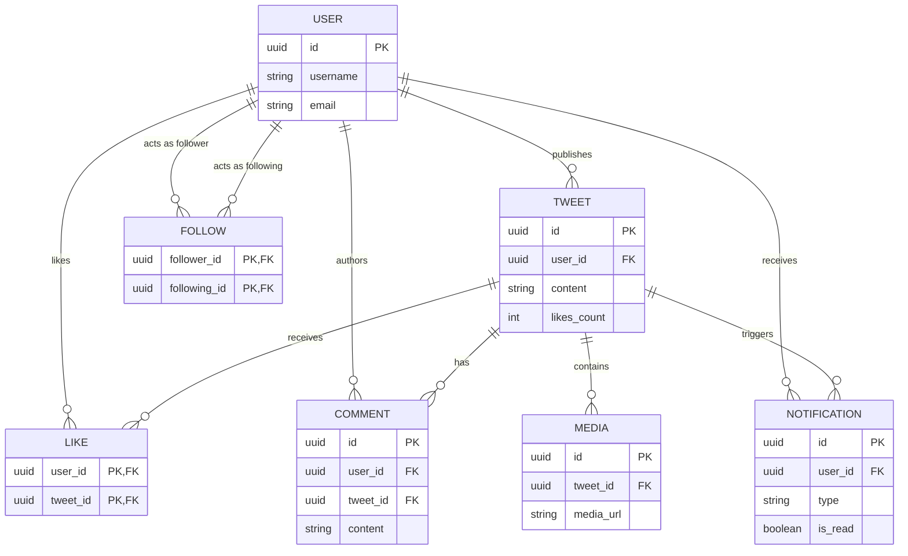

# Chapter 4. Domain Modeling

> **What are our core building blocks?** A high-level explanation of the 7 core data entities in our social network and how they connect to each other.

---

## 1. What is a Domain Model?

In software engineering, a **Domain Model** simply defines the real-world concepts our application manages. In a social networking app like Twitter, everything we build revolves around **7 primary entities**:

1. **👤 User**: The central actor. A person who registers an account, has a profile name, bio, avatar photo, and login credentials.
2. **📝 Tweet**: A short message (up to 280 characters) published by a user. Can include photos and keeps track of how many likes and comments it receives.
3. **🤝 Follow**: A one-way connection between two users. For example, User A (_Follower_) subscribes to User B (_Following_).
4. **❤️ Like**: A positive interaction showing that a user clicked the heart icon on a specific tweet.
5. **💬 Comment**: A text reply attached to a parent tweet, written by a user.
6. **🔔 Notification**: An alert sent to a user when someone interacts with them (e.g., "Sireesh liked your tweet").
7. **🖼️ Media**: A photo file stored in AWS S3 Cloud Storage that is attached to a tweet.

---

## 2. Entity Relationship Map (How They Connect)

How do these 7 pieces link together? Here is a simple, high-level visual map of our data connections:

---

## 3. How Data Connects (Simple Analogies)

To design a clean database later, we must understand the "rules of connection" (called **Cardinality**):

| Connection Pair                          | How Many?        | Everyday Analogy & System Rule                                                                                                                                                               |
| :--------------------------------------- | :--------------- | :------------------------------------------------------------------------------------------------------------------------------------------------------------------------------------------- |
| **User $\leftrightarrow$ Tweet**         | **One-to-Many**  | Like an author writing books. One user can write thousands of tweets, but a tweet belongs to exactly **one author**. If a user deletes their account, all their tweets vanish automatically! |
| **User $\leftrightarrow$ User (Follow)** | **Many-to-Many** | Like following people on Instagram. You can follow many accounts, and many accounts can follow you. We also enforce a common-sense rule: **You cannot follow yourself!**                     |
| **User $\leftrightarrow$ Tweet (Like)**  | **Many-to-Many** | You can like many tweets, and a popular tweet is liked by thousands of users. Our system enforces a strict rule: **You can only like a tweet once!** (No double-liking).                     |
| **Tweet $\leftrightarrow$ Comment**      | **One-to-Many**  | One tweet can have hundreds of reply comments. If the original parent tweet is deleted, all reply comments are cleaned up automatically.                                                     |
| **Tweet $\leftrightarrow$ Media**        | **One-to-Many**  | One tweet can attach between 0 and 4 photo images. Photos cannot exist without being attached to a parent tweet.                                                                             |

---

## 4. Domain Boundaries (Keeping Things Clean)

To keep our codebase organized, we group closely related entities together into family units called **Aggregates**:

- **The User Family**: Handles password security, email verification, and profile bios. Other parts of the app are not allowed to touch user passwords directly!
- **The Tweet & Media Family**: When a user creates a tweet with 2 photos, the tweet and the photo links are created together as a single package deal.
- **The Social Graph Family**: Manages follower lists and guarantees that follow relationships remain one-way and clean without duplicates.
