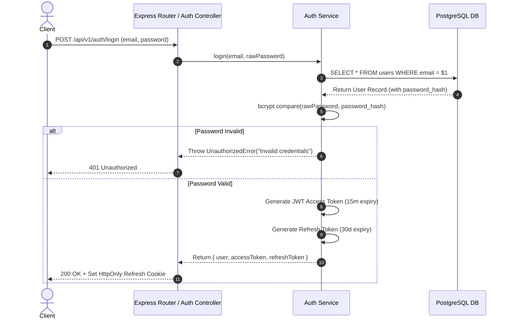
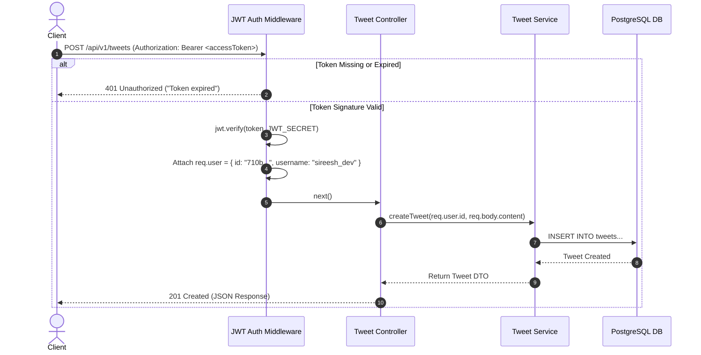

# Chapter 8. Authentication & Security System Design

> **Objective**: Design an enterprise-grade, stateless authentication system before writing code. Establish the distinction between Authentication and Authorization, implement password hashing with Argon2/bcrypt, define our Access & Refresh token rotation lifecycle, and detail complete sequence diagrams.

---

## 8.1 Authentication vs. Authorization

A secure system must clearly distinguish between identifying an actor and verifying their operational permissions:

*   **Authentication (Who are you?)**: Verifying user identity via credentials (e.g., matching email `sireesh@gmail.com` against a cryptographically hashed password).
*   **Authorization (What are you allowed to do?)**: Verifying whether an authenticated user has permission to perform a specific action on a specific resource (e.g., *Is User A authorized to execute `DELETE /api/v1/tweets/101`?* Only if User A is the author of Tweet `#101`).

---

## 8.2 Why We Never Store Plaintext Passwords

Storing passwords in plaintext or using fast, unkeyed hash functions (like MD5 or SHA-256) is a catastrophic security violation. If a database backup leaks, attackers can instantly reverse SHA-256 hashes using pre-computed Rainbow Tables or GPU brute-force clusters.

### The Cryptographic Solution: Argon2id / bcrypt
We use **Argon2id** (winner of the Password Hashing Competition) or **bcrypt** with a work factor (cost) of `12`.
1.  **Salt Generation**: A cryptographically random 16-byte salt is generated for every user upon registration.
2.  **Key Stretching**: The hashing algorithm intentionally consumes CPU cycles and memory for $\approx 250\text{ms}$, rendering GPU offline brute-force attacks economically impossible.
3.  **Database Storage**: The database stores only the resulting hash string containing the algorithm identifier, cost parameter, salt, and derived key:
    `$2b$12$e9k.../u1...Z8q...`

---

## 8.3 Stateless JWT Token Architecture

To maintain our stateless server design, we eliminate server-side session memory using **JSON Web Tokens (JWT)**.

### JWT Structure (`Header.Payload.Signature`)
*   **Header**: Specifies token type and cryptographic algorithm (`{"alg": "HS256", "typ": "JWT"}`).
*   **Payload (Claims)**: Contains non-sensitive user identifier metadata:
    ```json
    {
      "sub": "710b962e-041c-11e1-9234-0123456789ab",
      "username": "sireesh_dev",
      "role": "USER",
      "iat": 1722000000,
      "exp": 1722000900
    }
    ```
    > ⚠️ **CRITICAL SECURITY RULE**: Never store passwords, Social Security numbers, or confidential secrets inside a JWT payload! The payload is merely Base64Url-encoded and readable by anyone possessing the token.
*   **Signature**: Created by signing the encoded header and payload using our server's secret key (`JWT_SECRET`). If a client modifies their user ID in the payload, the signature verification fails instantly in our middleware!

---

## 8.4 Dual Token Lifecycle: Access Token vs. Refresh Token

Why don't we issue a single JWT that lasts for 1 year? Because if an attacker steals a long-lived JWT, they have full access to the account for an entire year without the user being able to revoke it!

We implement a **Dual Token Rotation Strategy**:

| Token Type | Lifespan (TTL) | Storage Location | Responsibility |
| :--- | :--- | :--- | :--- |
| **Access Token** | **15 Minutes** | In-Memory / HTTP Authorization Header (`Bearer <token>`)| Used for authenticating every API request. Short lifespan limits damage if stolen. |
| **Refresh Token** | **30 Days** | Secure, `HttpOnly`, `SameSite=Strict` Cookie | Used exclusively at `POST /api/v1/auth/refresh` to obtain a new Access Token without re-entering passwords. |

---

## 8.5 Sequence Diagrams

### 1. User Login & Token Issuance Flow



### 2. Protected API Request Flow



---

## 8.6 Logout & Token Revocation Strategy

Because JWT access tokens are stateless, logging out simply requires the client to discard the token from memory. However, to prevent stolen refresh tokens from being reused, we implement **Server-Side Revocation using Redis**:
1.  When a user logs out (`POST /api/v1/auth/logout`), we extract their Refresh Token.
2.  We store the token's unique ID (`jti` claim) in Redis as a **Blacklist Entry** with a TTL matching the remaining token lifespan (`SETEX blacklist:refreshToken:123 2592000 "revoked"`).
3.  During any future token renewal attempt (`POST /api/v1/auth/refresh`), the Auth Service checks Redis. If the token is found on the blacklist, the renewal is rejected immediately!

---

## 8.7 Summary of Security Best Practices

*   ✅ **Always** use Argon2id or bcrypt with cost factor $\ge 12$ for password hashing.
*   ✅ **Always** enforce HTTPS in production to prevent Man-in-the-Middle (MitM) token interception.
*   ✅ **Always** keep Access Token lifespans short ($\le 15\text{ minutes}$).
*   ✅ **Always** store Refresh Tokens in secure `HttpOnly`, `Secure`, `SameSite=Strict` browser cookies.
*   ✅ **Always** validate incoming user input with strict Zod runtime schemas before processing.
*   ❌ **Never** store plaintext passwords or secrets in database tables or environment git repos.
*   ❌ **Never** trust client-provided user IDs in URL parameters without validating against `req.user.id` in the JWT payload.
