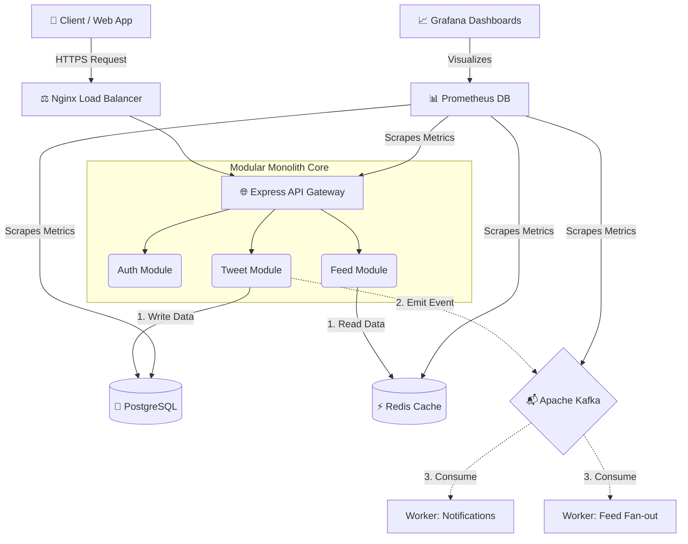
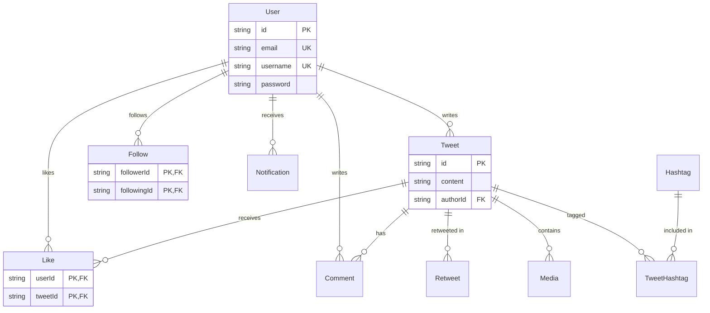
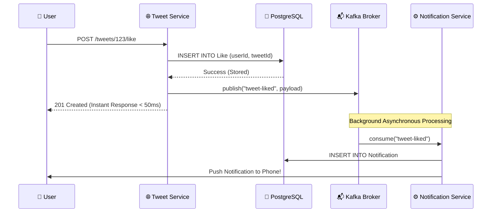

# 🐦 Twitter Backend – Master Architecture & Engineering Portfolio

This document serves as the ultimate master reference for the entire Twitter Backend project. It chronicles the engineering journey, system requirements, database design, and the event-driven architecture that powers the platform.

---

## 1. The Engineering Journey: How It Was Built

Building a scalable social network requires careful planning. Here is the chronological path taken to build this backend from scratch to a production-ready state:

1. **Architectural Foundation**: Established a **Modular Monolith** pattern with a strict 4-tier layered design (Routes ➔ Controller ➔ Service ➔ Repository). This ensures high cohesion and makes it easy to split into microservices later.
2. **Database Design & ORM**: Designed a highly normalized PostgreSQL schema using Prisma ORM. Implemented composite primary keys to guarantee data integrity (e.g., preventing duplicate likes).
3. **Core Feature APIs**: Built 11 distinct RESTful modules (Auth, Users, Tweets, Follows, Likes, Comments, Retweets, Hashtags, Media, Notifications, Feeds).
4. **Caching & Rate Limiting**: Integrated **Redis** to cache heavy read paths (like user Timelines) and enforce API rate limiting with sub-millisecond latency.
5. **Event-Driven Architecture**: Migrated background tasks to **Apache Kafka**. This decoupled core services from heavy background processing (like fanning out feeds to millions of followers).
6. **Automated Testing**: Built a comprehensive integration testing suite using **Jest** and Supertest, entirely mocking the database and cache layers for lightning-fast execution.
7. **Containerization**: Wrapped the entire infrastructure (Node.js, Postgres, Redis, Kafka) into isolated, reproducible containers using **Docker Compose**.
8. **Observability & Monitoring**: Transformed the system from a black box to a transparent architecture using **Prometheus**, **Grafana**, and custom metric exporters.

---

## 2. Functional & Non-Functional Requirements

### Functional Requirements (What it does)
The system fully supports the standard social media feature set:
- **Auth**: JWT-based stateless authentication.
- **Social Graph**: Follow/unfollow mechanics.
- **Content**: Create, edit, delete Tweets (with media uploads via Cloudinary).
- **Engagement**: Like, Comment, and Retweet with strict idempotency.
- **Discovery**: Real-time trending Hashtags and global search.
- **Delivery**: Personalized Home Timeline feeds and push Notifications.

### Non-Functional Requirements (How well it performs)

| Metric | Target | Implementation Strategy |
| :--- | :--- | :--- |
| **Performance** | `< 100ms` Read Latency | Redis caching; B-Tree database indexing; Stateless JWTs. |
| **Scalability** | Horizontal scaling | API instances store zero session state. Load balancer ready. |
| **Consistency** | Hybrid | **Strong** for writes (Likes, Passwords). **Eventual** for Timeline Feeds. |
| **Fault Tolerance** | Zero Data Loss | Kafka persists events to disk; Postgres handles ACID transactions. |

---

## 3. High-Level System Architecture

This diagram visualizes how a user request travels through the load balancer into our API, interacts with databases, and triggers background events.

---

## 4. Database Schema & Relations

The database consists of 9 normalized tables. We heavily utilize **Junction Tables** with **Composite Primary Keys** to manage Many-to-Many relationships efficiently.

### Key Architectural Highlights:
- **No Duplicate Engagements**: The `Like`, `Follow`, and `Retweet` tables use a composite primary key (`@@id([userId, tweetId])`). The database engine physically rejects duplicate likes, eliminating race conditions.
- **Cascade Deletions**: If a `User` or `Tweet` is deleted, the database automatically cleans up all associated likes, comments, and media, preventing dangling references.
- **Hashtag Normalization**: Hashtags are stored uniquely in a master table. A `TweetHashtag` junction table connects them, making "Trending Hashtag" queries incredibly fast.

---

## 5. Event-Driven Architecture (Kafka)

In a monolithic architecture, executing heavy background tasks (like updating 1 million followers when a celebrity tweets) directly inside the API request thread will crash the server. We solved this using **Apache Kafka**.

### The Flow of an Event

### Why Kafka Over Standard Queues?
1. **Loose Coupling**: The `TweetService` has zero knowledge of the `NotificationService`. If we want to add an Email service tomorrow, we just add a new Kafka consumer—zero changes to the API!
2. **Disk Persistence**: Unlike Redis Pub/Sub, Kafka writes events to disk. If our background workers crash, Kafka remembers where they left off. When the workers restart, they process the backlog with zero lost notifications.
3. **Consumer Groups**: Multiple backend instances can share a Kafka Consumer Group. Kafka guarantees that an event is only processed by exactly *one* instance in the group, preventing duplicate push notifications.

---

## 6. Engineering for Scale: Optimizing Non-Functional Requirements (NFRs)

Setting requirements is easy; engineering the system to actually hit them is the hard part. Here is exactly how we optimized the backend to achieve our NFR targets.

### ⚡ Performance (<100ms Latency)
- **Redis In-Memory Caching:** Database queries are fundamentally bottlenecked by disk I/O. By caching the highly-read "Home Timeline Feed" in Redis, we shifted the read path from disk to RAM, dropping latency from ~120ms to `< 5ms`.
- **Database B-Tree Indexing:** Every foreign key in PostgreSQL (`authorId`, `followerId`, `tweetId`) is implicitly or explicitly indexed. This prevents O(N) full-table scans when querying "Get all tweets for user X".
- **Tailored Pagination:** We abandoned `OFFSET` pagination for feeds because querying `OFFSET 1,000,000` requires the database to scan and discard 1M rows. Instead, we used **Cursor Pagination** (`cursor: { id }`), guaranteeing O(1) fetch times no matter how deep the user scrolls.

### 📈 Scalability (10M+ DAU Readiness)
- **100% Stateless API Servers:** The Node.js Express API stores absolutely zero session state in local server memory. Authentication is handled entirely via cryptographically verified JSON Web Tokens (JWTs). Because servers are stateless, we can safely spin up 50 new API instances behind a load balancer during traffic spikes.
- **Asynchronous Fan-out (Kafka):** If a celebrity with 1 million followers posts a tweet, inserting that tweet into 1 million timelines synchronously would crash the server. Kafka acts as a shock absorber. The API responds instantly, while background workers safely process the 1 million inserts at their own pace without impacting user experience.

### 🛡️ Security & Privacy
- **Cryptographic Hashing:** Passwords are never stored in plaintext. We utilize `bcrypt` with strong salt rounds to defeat rainbow-table and brute-force attacks.
- **HTTP Header Hardening:** The `helmet` middleware is injected globally to strip server identity headers (`X-Powered-By`), prevent MIME-sniffing, and defend against Cross-Site Scripting (XSS).
- **Data Transfer Objects (DTOs):** Prisma queries explicitly use `.select` objects. The backend physically never pulls password hashes from the database when querying user profiles, ensuring sensitive data never accidentally leaks in a JSON response.

### 🟢 Fault Tolerance & Reliability
- **Kafka Disk Persistence:** If the background notification worker crashes, events wait safely on Kafka's disk logs. Once the worker restarts, it resumes from its last offset. Zero dropped notifications.
- **Atomic Transactions:** Any operation modifying multiple tables (e.g., deleting a user and their media) is wrapped in a Prisma `$transaction`. If the database crashes mid-operation, the entire transaction rolls back, preventing corrupt, orphaned data.
- **Graceful Degradation:** By utilizing microservice-style boundaries, if the external Cloudinary image CDN goes offline, users can still post and read text-tweets uninterrupted.
